<p align="center">
  
</p>

<h1 align="center">⚡ Inverter Automator</h1>

<p align="center">
  <strong>Fully autonomous solar inverter control via GitHub Actions — zero hardware, zero server, zero cost.</strong>
</p>

<p align="center">
  <a href="https://github.com/impet14/inverter-automator/actions"></a>
  <a href="https://github.com/impet14/inverter-automator/blob/main/LICENSE"></a>
  <a href="https://www.python.org/"></a>
  <a href="https://line.me/"></a>
  
</p>

<p align="center">
  <a href="#-key-features">Features</a> •
  <a href="#-how-it-works">How It Works</a> •
  <a href="#%EF%B8%8F-architecture">Architecture</a> •
  <a href="#-quick-start">Quick Start</a> •
  <a href="#-schedule">Schedule</a> •
  <a href="#-faq">FAQ</a>
</p>

---

## 🤔 The Problem

Most solar PV owners with hybrid inverters want to **maximize self-consumption** — use solar energy during the day and switch to battery (SBU) at night. But doing this manually every day is tedious, and most "smart" solutions require:

- 🖥️ A dedicated home server or Raspberry Pi running 24/7
- 💰 Paid cloud services or subscriptions
- 🔧 Complex home automation setups (Home Assistant, Node-RED, etc.)

**What if you could automate your inverter with nothing but a GitHub account?**

## 💡 The Solution

**Inverter Automator** turns GitHub Actions into a **free, serverless solar inverter controller**. It communicates with ShineMonitor-compatible inverters via their cloud API to automatically switch output priority based on a time-based schedule — and sends real-time status notifications straight to your LINE Messenger.

> **No server. No hardware. No cost. Just push and forget.** ☀️

---

## ✨ Key Features

| Feature | Description |
|---|---|
| 🔄 **Auto Priority Switching** | Switches between Solar-first and SBU (Solar-Battery-Utility) priority modes on schedule |
| ⏰ **Smart Scheduling** | Cron-based schedules tuned for tropical/equatorial solar patterns |
| 📱 **LINE Notifications** | Real-time push notifications for mode changes via LINE Messenger Bot |
| 🛡️ **Retry & Resilience** | Configurable retry logic with exponential backoff for `set-*` commands |
| 📅 **Date-Aware Skipping** | Auto-skips solar switching during utility billing periods (23rd–26th) |
| 🎛️ **Manual Override** | One-click `workflow_dispatch` to trigger any command manually |
| 🔐 **Secrets-Based Config** | All credentials stored securely in GitHub Secrets — never in code |
| 💸 **100% Free** | Runs entirely on GitHub Actions free tier |

---

## 🏗️ Architecture

```mermaid
flowchart LR
    subgraph GitHub["☁️ GitHub Actions"]
        CRON["⏰ Cron Scheduler"] --> RESOLVE["🔍 Resolve Action"]
        MANUAL["🎛️ Manual Dispatch"] --> RESOLVE
        RESOLVE --> GATE{"📅 Date Gate"}
        GATE -->|Proceed| SCRIPT["🐍 inverter_control.py"]
        GATE -->|Skip| SKIP["⏭️ Skip Run"]
    end

    subgraph API["🌐 ShineMonitor Cloud"]
        SCRIPT -->|"read-status"| READ["📊 Query Priority"]
        SCRIPT -->|"set-solar"| SOLAR["☀️ Solar Mode"]
        SCRIPT -->|"set-sbu"| SBU["🔋 SBU Mode"]
    end

    subgraph Notify["📱 Notifications"]
        SOLAR --> LINE["💬 LINE Push"]
        SBU --> LINE
    end

    style GitHub fill:#161b22,stroke:#58a6ff,color:#c9d1d9
    style API fill:#161b22,stroke:#f0c040,color:#c9d1d9
    style Notify fill:#161b22,stroke:#00C300,color:#c9d1d9
```



### How the Flow Works

1. **Trigger** — GitHub Actions fires on cron schedule or manual dispatch
2. **Resolve** — Determines which action to execute based on the cron expression or user input
3. **Date Gate** — Skips `set-solar` during billing period (23rd–26th of each month) unless force-overridden
4. **Execute** — Calls ShineMonitor API with retry logic
5. **Notify** — Sends result to LINE (for `set-*` commands only; `read-status` is silent)

---

## 🚀 Quick Start

### Prerequisites

- A **ShineMonitor-compatible** hybrid inverter (e.g., Growatt, PowMr, or similar)
- A **LINE Messaging API** bot ([create one here](https://developers.line.biz/console/))
- A **GitHub account** (free tier is sufficient)

### 1. Fork & Clone

```bash
gh repo fork impet14/inverter-automator --clone
cd inverter-automator
```

### 2. Configure GitHub Secrets

Go to **Settings → Secrets and variables → Actions** and add:

| Secret | Description |
|---|---|
| `INVERTER_TOKEN` | Your ShineMonitor API authentication token |
| `LINE_CHANNEL_ACCESS_TOKEN` | LINE Messaging API channel access token |
| `LINE_USER_ID` | Your LINE user ID (for push messages) |

### 3. Customize Your Schedule

Edit `.github/workflows/scheduler.yml` to match your timezone and solar patterns:

```yaml
schedule:
  - cron: '10,20,30 23 * * *'  # ☀️ Set Solar priority (UTC)
  - cron: '45 10 * * *'        # 🔋 Set SBU priority (UTC)
  - cron: '0,15 11 * * *'      # 🔋 Set SBU priority (UTC)
  - cron: '0 */2 * * *'        # 📊 Status check every 2h
```

> **💡 Tip:** All cron times are in **UTC**. For Bangkok (UTC+7), `23:10 UTC` = `06:10 local time`.

### 4. Enable Actions

Go to the **Actions** tab in your forked repo and enable workflows. That's it — your inverter is now automated! 🎉

---

## 📅 Schedule

The default schedule is optimized for **Southeast Asia / tropical regions** (UTC+7):

| Local Time (UTC+7) | Action | Purpose |
|---|---|---|
| 06:10, 06:20, 06:30 | `set-solar` ☀️ | Switch to solar-first as sun rises |
| 17:45 | `set-sbu` 🔋 | Switch to battery-first before sunset |
| 18:00, 18:15 | `set-sbu` 🔋 | Retry SBU in case of API failure |
| Every 2 hours | `read-status` 📊 | Silent health check (no LINE notification) |

### Billing Period Logic

To avoid unnecessary solar switching during peak utility billing adjustment days, `set-solar` is **automatically skipped on the 23rd–26th of each month** (unless manually overridden via `workflow_dispatch`).

---

## 📂 Project Structure

```
inverter-automator/
├── 📄 inverter_control.py          # Core automation script
├── 📋 requirements.txt             # Python dependencies
├── 📖 README.md                    # You are here
├── 📁 docs/
│   └── 🖼️ banner.png              # Repository banner
└── 📁 .github/workflows/
    └── ⚙️ scheduler.yml            # GitHub Actions cron scheduler
```

---

## 🔧 Supported Commands

```bash
# Read current output priority status
python inverter_control.py read-status

# Set output priority to Solar-first
python inverter_control.py set-solar

# Set output priority to SBU (Solar-Battery-Utility)
python inverter_control.py set-sbu
```

---

## 🔌 Compatibility

This project communicates with the **ShineMonitor** cloud platform, which supports a wide range of hybrid inverters:

| Brand | Compatibility |
|---|---|
| Growatt | ✅ SPF / SPH / MIN series |
| PowMr | ✅ POW-HVM series |
| MPP Solar | ✅ PIP / LV series |
| Other | ⚠️ Any ShineMonitor-compatible inverter |

> **📝 Note:** You'll need to capture your device's `PN`, `SN`, `DEVCODE`, and `DEVADDR` from the ShineMonitor app. See the [Wiki](../../wiki) for a step-by-step guide.

---

## ❓ FAQ

<details>
<summary><b>Is this really free?</b></summary>

Yes! GitHub Actions offers **2,000 minutes/month** on the free tier. This project uses approximately **~200 minutes/month** (under 10% of the quota), so it costs absolutely nothing.

</details>

<details>
<summary><b>How do I get my ShineMonitor token?</b></summary>

1. Open the ShineMonitor / EybondSmart app on your phone
2. Use a network proxy tool (e.g., HTTP Toolkit) to capture the API token from network requests
3. The token appears in the URL as `&token=YOUR_TOKEN`

</details>

<details>
<summary><b>Can I use Telegram/Discord instead of LINE?</b></summary>

Yes! The notification system is modular. Replace the `send_line_debug()` function with your preferred messaging API. PRs for additional notification channels are welcome!

</details>

<details>
<summary><b>What happens if the API call fails?</b></summary>

For `set-*` commands, the script retries up to 3 times with a 5-second delay between attempts. If all retries fail, a failure notification is sent to LINE and the workflow exits with a non-zero code. For `read-status`, only a single attempt is made (no retry, no LINE notification).

</details>

<details>
<summary><b>Can I add more commands?</b></summary>

Absolutely! Add a new entry to the `URL_CONFIG` dictionary in `inverter_control.py`, then add the corresponding option to the `workflow_dispatch` choices in `scheduler.yml`.

</details>

---

## 🤝 Contributing

Contributions are welcome! Whether it's adding support for new inverter brands, notification channels, or improving the scheduling logic.

1. Fork the repository
2. Create a feature branch (`git checkout -b feature/amazing-feature`)
3. Commit your changes (`git commit -m 'Add amazing feature'`)
4. Push to the branch (`git push origin feature/amazing-feature`)
5. Open a Pull Request

---

## 📜 License

This project is open source and available under the [MIT License](LICENSE).

---

## ⭐ Star History

If this project helped you automate your solar setup, please consider giving it a ⭐ — it helps others discover it!

---

<p align="center">
  <sub>Built with ☀️ by a solar enthusiast who was tired of switching modes manually every day.</sub>
</p>
